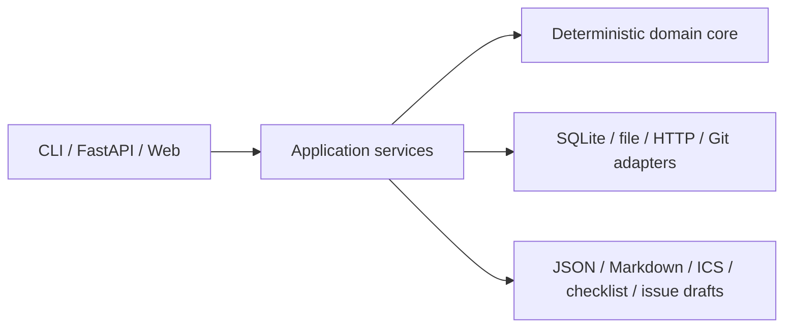

# Sunset Sentinel API

[简体中文](README.zh-CN.md)

[](https://github.com/KanadeK/sunset-sentinel-api/actions/workflows/ci.yml)
[](https://github.com/KanadeK/sunset-sentinel-api/releases/latest)
[](LICENSE)

Third-party APIs rarely disappear without warning, but their warnings are scattered across
headers, OpenAPI files, migration notes, and consumer inventories. Sunset Sentinel API turns
those signals into one prioritized, migration-ready queue.

- **See the whole lifecycle:** normalize `Sunset`, `Deprecation`, OpenAPI, and manual signals.
- **Act on impact:** connect affected consumers to urgency, blast-radius, and priority scores.
- **Keep control:** run offline by default with deterministic reports and local SQLite storage.


**v0.1.0 status:** initial public alpha; the CLI, local web/API, scheduler, fixture server,
container definition, and five exporters are implemented, with the quality and release gates
documented below.
[Open the static demo](https://kanadek.github.io/sunset-sentinel-api/) to inspect synthetic
results; it is a read-only snapshot, not a hosted mutable backend.

Fastest run from a cloned checkout (Python 3.12):

```bash
python -m pip install .
sunset-sentinel demo --database demo.db --output-dir demo-output
sunset-sentinel serve --database demo.db
```

Then open <http://127.0.0.1:8000/>. The bundled offline inputs produce three lifecycle records.
For example, `GET /v1/orders` becomes `deprecated`, retains its exact deprecation and sunset
dates, maps to the critical `Checkout Web` consumer, and receives priority `75`.

```console
$ sunset-sentinel import --database demo.db --openapi fixture-api=examples/openapi.yaml --feed examples/manual-feed.yaml --consumers examples/consumers.json --at 2026-07-23T00:00:00Z
{"consumers":2,"dependencies":3,"discovered":3,"signals":3,"updated":0,"withdrawn":0}
```

**Privacy boundary:** sample import, local file import, reporting, watch mode, and the dashboard
do not send data to an external service. Network access happens only for an explicit
`scan-http` URL whose host is allowlisted by the operator. See
[Privacy and security](docs/PRIVACY_AND_SECURITY.md).

## Features

- Parses the [RFC 8594](https://www.rfc-editor.org/rfc/rfc8594) `Sunset` header and
  [RFC 9745](https://www.rfc-editor.org/rfc/rfc9745) `Deprecation` header in strict or explicitly
  selected compatibility mode.
- Imports OpenAPI 3.x metadata, a small manual YAML feed, and a JSON consumer/dependency
  inventory.
- Normalizes signals into deterministic lifecycle states, diagnostics, scores, and
  discovered/updated/withdrawn change history.
- Persists first-seen and last-seen evidence in SQLite with WAL mode, foreign keys, and bounded
  lifecycle-header caching.
- Exports JSON assessments, Markdown reports, iCalendar events, migration checklists, and
  GitHub-ready issue drafts.
- Provides a local CLI, a FastAPI API with one guarded sample-import mutation, a
  keyboard-friendly web dashboard, a periodic local-file watcher, and a deterministic HTTP
  fixture server.
- Includes an opt-in, read-only Git provenance helper for tracked local files; the default import
  command does not invoke Git.

## Non-goals

Sunset Sentinel is deliberately not an API crawler, uptime monitor, or migration bot. It does
not enumerate endpoints, collect credentials, follow lifecycle links, modify provider systems,
post issue drafts, or rewrite consumer code. A provider signal is evidence to investigate, not
an authoritative guarantee that an API will or will not disappear.

## Signal semantics

### Standards mode

RFC 8594 defines `Sunset` as an HTTP date:

```http
Sunset: Wed, 11 Nov 2026 11:11:11 GMT
```

RFC 9745 defines `Deprecation`; a dated value uses Structured Fields date syntax, written as
`@` followed by Unix seconds:

```http
Deprecation: @1688169599
```

Strict mode accepts the standards forms. It rejects malformed dates, duplicate singleton
headers, control characters, and obsolete draft syntax. Lifecycle URLs in
`Link: <...>; rel="deprecation"` or `rel="sunset"` are recorded as evidence but never followed.

### Compatibility mode

Use `--header-mode compat` only for a provider that still emits known legacy syntax. It adds two
bounded fallbacks:

- `Sunset` may end in the non-standard `UTC` alias instead of `GMT`.
- `Deprecation` may be the obsolete draft value `true` or an IMF-fixdate.

Accepted compatibility values remain marked with diagnostics; compatibility mode never turns
arbitrary strings into dates.

## Architecture

The I/O-independent domain core owns parsing, lifecycle assessment, scoring, and change
detection. Application services orchestrate it; adapters handle all I/O.



That boundary keeps the same assessment semantics across the CLI, API, dashboard, watcher, and
tests. More detail is in [Architecture](docs/ARCHITECTURE.md).

## Installation

Sunset Sentinel supports CPython 3.12 (`>=3.12,<3.13`).

### From source

```bash
git clone https://github.com/KanadeK/sunset-sentinel-api.git
cd sunset-sentinel-api
python -m venv .venv
python -m pip install .
sunset-sentinel --version
```

Activate the virtual environment first if desired. On Windows, `py -3.12` may be used instead
of `python`.

### From a GitHub release

Download the wheel from [Releases](https://github.com/KanadeK/sunset-sentinel-api/releases),
then install the local artifact:

```bash
python -m pip install ./sunset_sentinel_api-0.1.0-py3-none-any.whl
```

No PyPI publication is implied by this repository.

### Development install

```bash
python -m pip install -e ".[dev]"
```

The development extra is version-pinned and includes formatting, linting, typing, testing,
coverage, audit, and build tools.

## Quick start

The deterministic demo uses only files in `examples/` and a fixed assessment clock:

```bash
sunset-sentinel demo \
  --database demo.db \
  --sample-dir examples \
  --output-dir demo-output \
  --at 2026-07-23T00:00:00Z
```

It creates:

| File | Purpose |
| --- | --- |
| `demo-output/assessment.json` | Machine-readable records, evidence summaries, and scores |
| `demo-output/report.md` | Human review report |
| `demo-output/lifecycle.ics` | Calendar milestones |
| `demo-output/migration-checklist.md` | Operator checklist |
| `demo-output/issue-drafts.json` | Draft issue payloads; nothing is posted |

Start the local UI against the same database:

```bash
sunset-sentinel serve --database demo.db --sample-dir examples
```

## Complete offline input-to-output example

Initialize a database, import all three bundled source types, and render a report at a fixed
time:

```bash
sunset-sentinel init --database sentinel.db

sunset-sentinel import \
  --database sentinel.db \
  --openapi fixture-api=examples/openapi.yaml \
  --feed examples/manual-feed.yaml \
  --consumers examples/consumers.json \
  --at 2026-07-23T00:00:00Z

sunset-sentinel report \
  --database sentinel.db \
  --format json \
  --output assessment.json \
  --at 2026-07-24T00:00:00Z
```

The checked-in fixtures yield three records. This excerpt is representative of the real JSON
assessment:

```json
{
  "target_id": "fixture-api",
  "state": "deprecated",
  "deprecation_at": "2026-06-30T23:59:59Z",
  "sunset_at": "2026-09-30T23:59:59Z",
  "endpoints": [
    {
      "method": "GET",
      "path": "/v1/orders",
      "operation_id": "listOrders"
    }
  ],
  "consumers": [
    {
      "id": "checkout-web",
      "name": "Checkout Web",
      "criticality": "critical"
    }
  ],
  "scores": {
    "urgency": 75,
    "urgency_band": "high",
    "blast_radius": 27,
    "blast_radius_band": "medium",
    "priority": 75,
    "priority_band": "high"
  }
}
```

The other fixtures demonstrate an unknown deprecation date and a manually tracked service
lifecycle. See [the sample-data guide](examples/README.md) for their schemas.

## CLI

Run `sunset-sentinel COMMAND --help` for the complete option set.

| Command | What it does |
| --- | --- |
| `init` | Initializes the local SQLite schema |
| `import` | Imports OpenAPI, manual-feed, and consumer-inventory files |
| `scan-http` | Fetches lifecycle headers from one explicitly approved URL |
| `report` | Writes one selected export format |
| `demo` | Runs the deterministic bundled offline workflow |
| `watch` | Periodically refreshes local inputs and output files |
| `serve` | Starts the loopback-only local dashboard and JSON API |
| `fixture-server` | Starts deterministic loopback HTTP fixtures for testing |

Multiple OpenAPI sources can be supplied by repeating
`--openapi TARGET_ID=PATH`. All `--at` values are RFC 3339 timestamps. Reusing a database
preserves first/last-seen evidence and produces explicit discovered, updated, or withdrawn
changes instead of silently replacing history.

Files supplied in one import are the authoritative snapshot for their supplied category:
OpenAPI is reconciled per target ID, while the provided manual feeds and consumer maps are
reconciled collectively. A category omitted from the command is left untouched. This makes a
removed lifecycle marker or dependency leave the current impact view without letting an older
snapshot overwrite newer evidence.

## Local API

Start it with:

```bash
sunset-sentinel serve --database sentinel.db --host 127.0.0.1 --port 8000
```

Interactive OpenAPI and ReDoc endpoints are intentionally disabled. The supported surface is:

| Method | Route | Purpose |
| --- | --- | --- |
| `GET` | `/api/health` | Version, database readiness, and record counts |
| `GET` | `/api/records` | Current lifecycle assessment |
| `GET` | `/api/changes` | Discovered, updated, and withdrawn history |
| `POST` | `/api/import/sample` | Import bundled synthetic inputs |
| `GET` | `/api/export/json` | Download JSON assessment |
| `GET` | `/api/export/markdown` | Download Markdown report |
| `GET` | `/api/export/calendar` | Download iCalendar events |
| `GET` | `/api/export/checklist` | Download the migration checklist |
| `GET` | `/api/export/issues` | Download issue drafts |

The only mutating web route requires the exact local confirmation header:

```bash
curl -X POST \
  -H "X-Sunset-Sentinel: dashboard-v1" \
  http://127.0.0.1:8000/api/import/sample
```

`X-Sunset-Sentinel` reduces accidental browser-originated mutations; it is not authentication.
Keep the service on loopback unless you add an appropriate trusted reverse proxy and access
control. API and dashboard responses include a restrictive CSP, no-referrer, no-sniff,
frame-denial, and no-store headers.

## Web dashboard and static demo

The local dashboard at `/` reads the selected SQLite database, can import the bundled synthetic
sample after confirmation, filters lifecycle records, exposes change history, and downloads all
five export formats.

The GitHub Pages site is intentionally different: it is a static, read-only rendering of
synthetic data. It has no live API, does not accept uploads, and cannot mutate your local
database. Run `serve` for the interactive local application.

## Watch mode

Watch mode schedules repeat imports of local files inside the current process and atomically
replaces the five output files:

```bash
sunset-sentinel watch \
  --database sentinel.db \
  --openapi fixture-api=examples/openapi.yaml \
  --feed examples/manual-feed.yaml \
  --consumers examples/consumers.json \
  --interval-minutes 60 \
  --job-id bundled-sources \
  --output-dir watch-output
```

Add `--once` to run one refresh and exit. The v0.1.0 scheduler is in-process: stopping the
process stops the schedule, and relaunching the command resumes it. Watch mode refreshes local
file sources; it does not silently turn them into recurring network scans.

## Explicit HTTP scanning and the fixture server

HTTP scanning is opt-in and one URL at a time. The hostname must be present in `--allow-host`;
HTTPS is required except when `--allow-loopback` explicitly enables a loopback fixture.
Credentials in URLs are rejected, redirects and lifecycle links are not followed, query values
are redacted, response bodies are discarded, and only bounded lifecycle metadata is cached.
The minimum per-origin request interval and provider `Retry-After` deadline are coordinated
atomically through the selected SQLite database, so separate CLI processes cannot silently reset
the pacing boundary.

Terminal 1:

```bash
sunset-sentinel fixture-server --host 127.0.0.1 --port 8765
```

Terminal 2:

```bash
sunset-sentinel scan-http \
  --database fixture.db \
  --target-id fixture-http \
  --url http://127.0.0.1:8765/v1/orders \
  --method GET \
  --allow-host 127.0.0.1 \
  --allow-loopback \
  --header-mode strict \
  --at 2026-07-23T00:00:00Z
```

The fixture server is deterministic and loopback-only. Its endpoints cover a normal lifecycle,
an unknown-date deprecation, conflicting evidence, migration links, and conditional `ETag`
handling without requiring the public internet.

## Containers

The Compose profile binds only to host loopback and persists SQLite in a named volume:

```bash
docker compose up --build
```

Open <http://127.0.0.1:8000/>. The image uses a non-root user, a read-only root filesystem in
Compose, dropped Linux capabilities, `no-new-privileges`, a temporary `/tmp`, and a health
check. No secret or external credential is baked into the image.

Equivalent direct commands:

```bash
docker build -t sunset-sentinel-api:0.1.0 .
docker run --rm \
  -p 127.0.0.1:8000:8000 \
  -v sunset-sentinel-data:/data \
  sunset-sentinel-api:0.1.0
```

## Sample data

All bundled examples are synthetic:

| Path | Contents |
| --- | --- |
| `examples/openapi.yaml` | Deprecated operations, dates, documentation, and replacement hints |
| `examples/manual-feed.yaml` | A lifecycle notice that is not sourced from OpenAPI |
| `examples/consumers.json` | Criticality-ranked consumers and their dependencies |

Do not put production credentials in these files. The formats and expected relationships are
documented in [examples/README.md](examples/README.md).

## Tests and release gates

Install the development extra and run the complete local gate:

```bash
python -m pip install -e ".[dev]"
make verify
```

`make verify` checks formatting, lint, strict typing, unit/integration/end-to-end tests, branch
coverage with an 80% floor, and package construction. The direct cross-platform entry point is:

```bash
python scripts/verify.py
```

Release-oriented convenience targets are:

| Target | Purpose |
| --- | --- |
| `make demo` | Rebuild deterministic demo outputs |
| `make benchmark` | Run the deterministic benchmark |
| `make package` | Build wheel and source distribution |
| `make release-check` | Run the complete release-readiness gate |

GitHub Actions runs CI in
[ci.yml](https://github.com/KanadeK/sunset-sentinel-api/actions/workflows/ci.yml), security
checks in
[security.yml](https://github.com/KanadeK/sunset-sentinel-api/actions/workflows/security.yml),
tagged packaging in
[release.yml](https://github.com/KanadeK/sunset-sentinel-api/actions/workflows/release.yml),
and the synthetic static demo deployment in
[pages.yml](https://github.com/KanadeK/sunset-sentinel-api/actions/workflows/pages.yml).
The exact manual release sequence is in the
[release checklist](docs/RELEASE_CHECKLIST.md).

## Privacy and security

- Offline workflows do not call provider APIs or external analytics.
- `scan-http` requires both an explicit URL and hostname allowlist; loopback HTTP needs a second
  explicit flag.
- URLs containing credentials are rejected, query values are redacted, redirects are disabled,
  and bodies are never retained.
- The SQLite database and generated reports may still contain internal endpoint names,
  consumer names, repository paths, and lifecycle evidence. Treat them as internal artifacts
  unless reviewed for publication.
- Sample import is protected by `X-Sunset-Sentinel: dashboard-v1`, but v0.1.0 has no user
  authentication or multi-tenant authorization.

Review the full [privacy and security boundary](docs/PRIVACY_AND_SECURITY.md). Report
vulnerabilities through [SECURITY.md](SECURITY.md), not a public issue.

## Limitations and roadmap

v0.1.0 is a local-first alpha. Its scheduler is process-local, HTTP scans are intentionally
single-target and unauthenticated, issue output is draft-only, and the scoring model is a
transparent prioritization aid rather than a service-level prediction.

Likely follow-up areas, without a committed delivery date, include:

- configurable scoring policy and richer explanation views;
- durable or externally orchestrated schedules;
- opt-in authenticated connectors after a dedicated threat-model review;
- additional import/export adapters driven by real interoperability cases.

See [CHANGELOG.md](CHANGELOG.md) for shipped changes.

## Competitor difference

A sample search of public repositories found no active project with both the same name and a
highly isomorphic feature set. This is a narrow sampled observation, not a uniqueness claim or
an exhaustive market survey.

The project is differentiated by the combination of standards-aware lifecycle parsing,
consumer-aware impact scoring, and deterministic local-first outputs. The search method,
boundaries, and adjacent categories are recorded in
[the competitor scan](docs/COMPETITOR_SCAN.md).

## Contributing

Bug reports, focused feature proposals, documentation fixes, and interoperability fixtures are
welcome. Read [CONTRIBUTING.md](CONTRIBUTING.md) and the
[Code of Conduct](CODE_OF_CONDUCT.md) before opening a pull request. Keep fixtures synthetic,
add tests for changed behavior, and run `make verify`.

Use the [issue tracker](https://github.com/KanadeK/sunset-sentinel-api/issues) for normal bugs
and feature discussions. Use the private route in [SECURITY.md](SECURITY.md) for vulnerabilities.

## FAQ

### Does the demo access the internet?

No. `demo`, local `import`, `report`, `watch`, and the dashboard's bundled sample import operate
on local files and SQLite. Only an explicit `scan-http` command performs a provider request.

### Why is `X-Sunset-Sentinel` required?

It is a deliberate confirmation token for the dashboard's one mutating endpoint, helping reject
accidental cross-origin form requests. It is not a credential or a replacement for
authentication.

### Should I choose strict or compatibility header mode?

Start with `strict`. Select `compat` for a known legacy provider, inspect the emitted
diagnostics, and migrate back to strict parsing when the provider fixes its syntax.

### Does a recorded sunset date prove an endpoint will be removed?

No. The tool preserves provider evidence and prioritizes follow-up. Confirm high-impact dates
against provider documentation and your contract.

### Can I expose the local server to a team?

The `serve` command intentionally accepts only loopback. For shared access, put the ASGI app
behind authentication, TLS, and an appropriately configured trusted reverse proxy; that
deployment is outside the v0.1.0 security boundary.

### Is the SQLite database safe to publish?

Not automatically. It may reveal internal service, operation, consumer, and local-path metadata
even though HTTP query values are redacted. Review both the database and exports before sharing.

### Which Python versions are supported?

CPython 3.12 only for v0.1.0.

## License

[MIT](LICENSE) © KanadeK.
