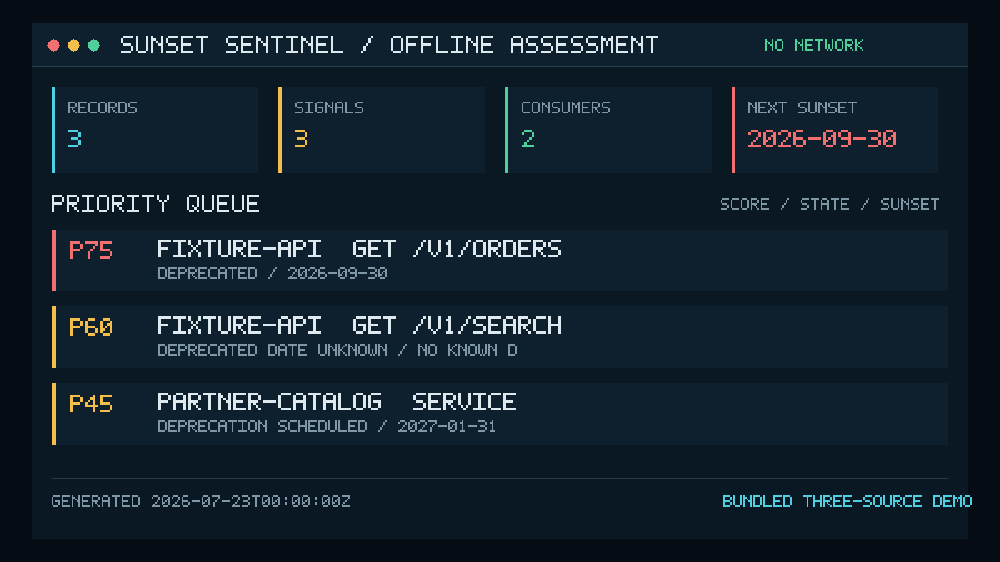
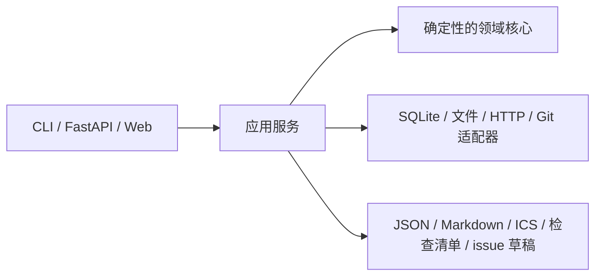

# Sunset Sentinel API

[English](README.md) | **简体中文**

[](https://github.com/KanadeK/sunset-sentinel-api/actions/workflows/ci.yml)
[](https://github.com/KanadeK/sunset-sentinel-api/releases/latest)
[](LICENSE)

第三方 API 通常不会毫无征兆地消失，但它的预警可能散落在响应头、OpenAPI 文件、迁移公告和
调用方清单中。Sunset Sentinel API 将这些信号汇总成一个有优先级、可执行的迁移队列。

- **看清完整生命周期：** 统一处理 `Sunset`、`Deprecation`、OpenAPI 和人工维护的信号。
- **按影响采取行动：** 将受影响调用方关联到紧迫度、影响面和优先级评分。
- **数据留在自己手中：** 默认离线运行，输出可复现报告，并使用本地 SQLite 存储。



**v0.1.0 状态：** 首个公开 Alpha 版本；CLI、本地 Web/API、定时器、测试夹具服务器、容器定义和
五种导出器均已实现，质量与发布门禁见下文。可以打开
[静态演示](https://kanadek.github.io/sunset-sentinel-api/)查看合成结果；它是只读快照，不是可写的
托管后端。

从已克隆的仓库最快启动（需要 Python 3.12）：

```bash
python -m pip install .
sunset-sentinel demo --database demo.db --output-dir demo-output
sunset-sentinel serve --database demo.db
```

然后打开 <http://127.0.0.1:8000/>。仓库内置的离线输入会生成三条生命周期记录。例如，
`GET /v1/orders` 会被判定为 `deprecated`，保留精确的弃用和下线日期，关联到关键级别的
`Checkout Web` 调用方，并得到优先级 `75`。

```console
$ sunset-sentinel import --database demo.db --openapi fixture-api=examples/openapi.yaml --feed examples/manual-feed.yaml --consumers examples/consumers.json --at 2026-07-23T00:00:00Z
{"consumers":2,"dependencies":3,"discovered":3,"signals":3,"updated":0,"withdrawn":0}
```

**隐私边界：** 样例导入、本地文件导入、报告、watch 模式和仪表盘都不会把数据发送到外部服务。
只有操作者明确执行 `scan-http`，并将目标主机加入允许列表时，才会访问网络。详见
[隐私与安全](docs/PRIVACY_AND_SECURITY.md)。

## 功能

- 以严格模式或显式选择的兼容模式解析 [RFC 8594](https://www.rfc-editor.org/rfc/rfc8594)
  `Sunset` 和 [RFC 9745](https://www.rfc-editor.org/rfc/rfc9745) `Deprecation` 响应头。
- 导入 OpenAPI 3.x 元数据、小型人工 YAML feed，以及 JSON 格式的调用方/依赖清单。
- 将信号规范化为可复现的生命周期状态、诊断、评分，以及
  discovered/updated/withdrawn 变更历史。
- 使用启用 WAL、外键和有界生命周期响应头缓存的 SQLite，持久化首次与最后一次观测证据。
- 导出 JSON 评估、Markdown 报告、iCalendar 事件、迁移检查清单和可用于 GitHub 的 issue 草稿。
- 提供本地 CLI、仅含一个受保护样例导入写操作的 FastAPI 接口、支持键盘操作的 Web 仪表盘、
  周期性本地文件 watcher，以及确定性的 HTTP 测试夹具服务器。
- 提供可选的只读 Git 来源查询工具，用于受跟踪的本地文件；默认导入命令不会调用 Git。

## 不做什么

Sunset Sentinel 不是 API 爬虫、可用性监控器或自动迁移机器人。它不会枚举端点、收集凭据、
跟随生命周期链接、修改提供方系统、发布 issue 草稿，也不会重写调用方代码。提供方信号是需要调查的
证据，并不能权威保证某个 API 一定会或一定不会下线。

## 信号语义

### 标准模式

RFC 8594 规定 `Sunset` 的值为 HTTP-date：

```http
Sunset: Wed, 11 Nov 2026 11:11:11 GMT
```

RFC 9745 定义 `Deprecation`；当值为日期时，使用 Structured Fields 的 Date 语法，即
`@` 后跟 Unix 秒数：

```http
Deprecation: @1688169599
```

严格模式接受上述标准格式，并拒绝格式错误的日期、重复的单值响应头、控制字符和已废弃的草案语法。
`Link: <...>; rel="deprecation"` 或 `rel="sunset"` 中的生命周期 URL 会作为证据记录，
但绝不会被自动访问。

### 兼容模式

只有在已知提供方仍发送旧格式时，才应使用 `--header-mode compat`。它只增加两个范围明确的
兼容规则：

- `Sunset` 可以使用非标准的 `UTC` 结尾，而不是 `GMT`。
- `Deprecation` 可以使用已废弃草案中的 `true` 或 IMF-fixdate。

被兼容接受的值仍会带有诊断信息；兼容模式不会把任意字符串猜测成日期。

## 架构

与 I/O 解耦的领域核心负责解析、生命周期评估、评分和变更检测；应用服务负责流程编排，
适配器承接全部 I/O。



这一边界确保 CLI、API、仪表盘、watcher 和测试使用相同的评估语义。更多细节见
[架构说明](docs/ARCHITECTURE.md)。

## 安装

Sunset Sentinel 支持 CPython 3.12（`>=3.12,<3.13`）。

### 从源码安装

```bash
git clone https://github.com/KanadeK/sunset-sentinel-api.git
cd sunset-sentinel-api
python -m venv .venv
python -m pip install .
sunset-sentinel --version
```

如有需要，请先激活虚拟环境。在 Windows 上可以使用 `py -3.12` 代替 `python`。

### 从 GitHub Release 安装

从 [Releases](https://github.com/KanadeK/sunset-sentinel-api/releases) 下载 wheel，
然后安装本地文件：

```bash
python -m pip install ./sunset_sentinel_api-0.1.0-py3-none-any.whl
```

本仓库不暗示该包已经发布到 PyPI。

### 开发环境

```bash
python -m pip install -e ".[dev]"
```

开发依赖已固定版本，包括格式检查、lint、类型检查、测试、覆盖率、安全审计和构建工具。

## 快速开始

确定性 demo 只读取 `examples/` 中的文件，并使用固定的评估时间：

```bash
sunset-sentinel demo \
  --database demo.db \
  --sample-dir examples \
  --output-dir demo-output \
  --at 2026-07-23T00:00:00Z
```

它会生成：

| 文件 | 用途 |
| --- | --- |
| `demo-output/assessment.json` | 供程序读取的记录、证据摘要和评分 |
| `demo-output/report.md` | 供人工审阅的报告 |
| `demo-output/lifecycle.ics` | 日历里程碑 |
| `demo-output/migration-checklist.md` | 运维迁移检查清单 |
| `demo-output/issue-drafts.json` | issue 草稿载荷；不会自动发布 |

使用同一个数据库启动本地界面：

```bash
sunset-sentinel serve --database demo.db --sample-dir examples
```

## 完整的离线输入到输出示例

初始化数据库，导入三种内置数据源，并在固定时间生成报告：

```bash
sunset-sentinel init --database sentinel.db

sunset-sentinel import \
  --database sentinel.db \
  --openapi fixture-api=examples/openapi.yaml \
  --feed examples/manual-feed.yaml \
  --consumers examples/consumers.json \
  --at 2026-07-23T00:00:00Z

sunset-sentinel report \
  --database sentinel.db \
  --format json \
  --output assessment.json \
  --at 2026-07-24T00:00:00Z
```

仓库内的夹具会生成三条记录。下面是实际 JSON 评估中具有代表性的一段：

```json
{
  "target_id": "fixture-api",
  "state": "deprecated",
  "deprecation_at": "2026-06-30T23:59:59Z",
  "sunset_at": "2026-09-30T23:59:59Z",
  "endpoints": [
    {
      "method": "GET",
      "path": "/v1/orders",
      "operation_id": "listOrders"
    }
  ],
  "consumers": [
    {
      "id": "checkout-web",
      "name": "Checkout Web",
      "criticality": "critical"
    }
  ],
  "scores": {
    "urgency": 75,
    "urgency_band": "high",
    "blast_radius": 27,
    "blast_radius_band": "medium",
    "priority": 75,
    "priority_band": "high"
  }
}
```

其余夹具分别展示“弃用日期未知”和“人工维护服务生命周期”。格式说明见
[样例数据指南](examples/README.md)。

## CLI

执行 `sunset-sentinel COMMAND --help` 可查看完整参数。

| 命令 | 作用 |
| --- | --- |
| `init` | 初始化本地 SQLite schema |
| `import` | 导入 OpenAPI、人工 feed 和调用方清单 |
| `scan-http` | 从一个明确获准的 URL 获取生命周期响应头 |
| `report` | 输出一种指定格式的报告 |
| `demo` | 运行确定性的内置离线流程 |
| `watch` | 周期性刷新本地输入和输出文件 |
| `serve` | 启动仅监听回环地址的本地仪表盘和 JSON API |
| `fixture-server` | 启动用于测试的确定性回环 HTTP 夹具 |

重复使用 `--openapi TARGET_ID=PATH` 可以提供多个 OpenAPI 源。所有 `--at` 值均为
RFC 3339 时间戳。复用数据库会保留首次/最后一次观测证据，并显式产生 discovered、updated
或 withdrawn 变更，而不是悄悄覆盖历史。

一次导入中实际提供的文件，是相应类别的权威快照：OpenAPI 按 target ID 对账，人工 feed
和调用方清单分别按本次提供的全集对账；命令中未提供的类别保持不变。因此，已移除的生命周期
标记或依赖会退出当前影响面，同时旧时间戳快照不能覆盖较新的证据。

## 本地 API

启动命令：

```bash
sunset-sentinel serve --database sentinel.db --host 127.0.0.1 --port 8000
```

交互式 OpenAPI 和 ReDoc 页面被有意关闭。支持的接口如下：

| 方法 | 路径 | 用途 |
| --- | --- | --- |
| `GET` | `/api/health` | 版本、数据库就绪状态和记录数量 |
| `GET` | `/api/records` | 当前生命周期评估 |
| `GET` | `/api/changes` | discovered、updated 和 withdrawn 历史 |
| `POST` | `/api/import/sample` | 导入内置合成样例 |
| `GET` | `/api/export/json` | 下载 JSON 评估 |
| `GET` | `/api/export/markdown` | 下载 Markdown 报告 |
| `GET` | `/api/export/calendar` | 下载 iCalendar 事件 |
| `GET` | `/api/export/checklist` | 下载迁移检查清单 |
| `GET` | `/api/export/issues` | 下载 issue 草稿 |

唯一会修改数据的 Web 路由要求精确的本地确认请求头：

```bash
curl -X POST \
  -H "X-Sunset-Sentinel: dashboard-v1" \
  http://127.0.0.1:8000/api/import/sample
```

Windows PowerShell 中可将 `curl` 换成 `curl.exe`。`X-Sunset-Sentinel` 用于降低浏览器来源的
意外修改风险，并不构成身份认证。除非已经增加可信反向代理和访问控制，否则请始终让服务监听回环地址。
API 和仪表盘响应带有严格 CSP、no-referrer、no-sniff、禁止嵌入 frame 和 no-store 响应头。

## Web 仪表盘与静态演示

本地 `/` 仪表盘读取指定 SQLite 数据库；经确认后可导入内置合成样例，筛选生命周期记录，
查看变更历史，并下载全部五种导出格式。

GitHub Pages 站点有意采用不同形态：它只是合成数据的静态只读渲染，没有实时 API，
不接收上传，也不能修改你的本地数据库。需要交互式本地应用时，请运行 `serve`。

## Watch 模式

Watch 模式在当前进程内周期性导入本地文件，并原子替换五个输出文件：

```bash
sunset-sentinel watch \
  --database sentinel.db \
  --openapi fixture-api=examples/openapi.yaml \
  --feed examples/manual-feed.yaml \
  --consumers examples/consumers.json \
  --interval-minutes 60 \
  --job-id bundled-sources \
  --output-dir watch-output
```

增加 `--once` 可只刷新一次并退出。v0.1.0 使用进程内调度器：进程停止，调度也会停止；
重新执行命令即可恢复。Watch 模式只刷新本地文件源，不会悄悄把它们变成周期性网络扫描。

## 显式 HTTP 扫描与夹具服务器

HTTP 扫描必须主动启用，并且每次只扫描一个 URL。主机名必须出现在 `--allow-host` 中；
除非使用 `--allow-loopback` 明确允许回环夹具，否则只接受 HTTPS。包含凭据的 URL 会被拒绝；
重定向和生命周期链接不会被跟随；查询参数值会脱敏；响应正文会被丢弃；缓存只保留有界的生命周期元数据。
每个来源的最小请求间隔及提供方的 `Retry-After` 截止时间会通过所选 SQLite 数据库进行原子
协调，因此不同 CLI 进程不能悄悄重置节流边界。

终端 1：

```bash
sunset-sentinel fixture-server --host 127.0.0.1 --port 8765
```

终端 2：

```bash
sunset-sentinel scan-http \
  --database fixture.db \
  --target-id fixture-http \
  --url http://127.0.0.1:8765/v1/orders \
  --method GET \
  --allow-host 127.0.0.1 \
  --allow-loopback \
  --header-mode strict \
  --at 2026-07-23T00:00:00Z
```

夹具服务器结果可复现，且只监听回环地址。其端点覆盖正常生命周期、弃用日期未知、证据冲突、
迁移链接和条件式 `ETag`，不需要访问公网。

## 容器

Compose 默认只绑定主机回环地址，并将 SQLite 持久化到命名 volume：

```bash
docker compose up --build
```

打开 <http://127.0.0.1:8000/>。镜像使用非 root 用户；Compose 中根文件系统只读，
移除 Linux capabilities，启用 `no-new-privileges`，提供临时 `/tmp` 和健康检查。
镜像中没有内置密钥或外部凭据。

等价的直接命令：

```bash
docker build -t sunset-sentinel-api:0.1.0 .
docker run --rm \
  -p 127.0.0.1:8000:8000 \
  -v sunset-sentinel-data:/data \
  sunset-sentinel-api:0.1.0
```

## 样例数据

所有内置样例均为合成数据：

| 路径 | 内容 |
| --- | --- |
| `examples/openapi.yaml` | 已弃用 operation、日期、文档和替代项提示 |
| `examples/manual-feed.yaml` | 并非来自 OpenAPI 的生命周期公告 |
| `examples/consumers.json` | 按关键程度分级的调用方及其依赖 |

不要在这些文件中放入生产凭据。格式和预期关系见
[examples/README.md](examples/README.md)。

## 测试与发布门禁

安装开发依赖并运行完整本地门禁：

```bash
python -m pip install -e ".[dev]"
make verify
```

`make verify` 检查格式、lint、严格类型、单元/集成/端到端测试、分支覆盖率（最低 80%）和包构建。
跨平台的直接入口是：

```bash
python scripts/verify.py
```

面向发布的便捷目标包括：

| 目标 | 用途 |
| --- | --- |
| `make demo` | 重新生成确定性演示输出 |
| `make benchmark` | 运行确定性基准测试 |
| `make package` | 构建 wheel 和源码包 |
| `make release-check` | 运行完整发布就绪门禁 |

GitHub Actions 通过
[ci.yml](https://github.com/KanadeK/sunset-sentinel-api/actions/workflows/ci.yml)运行 CI，
通过
[security.yml](https://github.com/KanadeK/sunset-sentinel-api/actions/workflows/security.yml)
运行安全检查，通过
[release.yml](https://github.com/KanadeK/sunset-sentinel-api/actions/workflows/release.yml)
完成标签发布，并通过
[pages.yml](https://github.com/KanadeK/sunset-sentinel-api/actions/workflows/pages.yml)
部署合成数据静态演示。完整的人工发布顺序见
[发布检查清单](docs/RELEASE_CHECKLIST.md)。

## 隐私与安全

- 离线流程不会调用提供方 API 或外部分析服务。
- `scan-http` 同时要求显式 URL 和主机允许列表；访问回环 HTTP 还需要第二个明确的开关。
- 含凭据的 URL 会被拒绝，查询参数值会被脱敏，重定向会被禁用，响应正文不会被保留。
- SQLite 数据库和生成的报告仍可能包含内部端点名、调用方名称、仓库路径和生命周期证据。
  未经审查时，应将它们视为内部资料。
- 样例导入由 `X-Sunset-Sentinel: dashboard-v1` 保护，但 v0.1.0 没有用户认证或多租户授权。

请阅读完整的[隐私与安全边界](docs/PRIVACY_AND_SECURITY.md)。发现漏洞时请按
[SECURITY.md](SECURITY.md) 私下报告，不要创建公开 issue。

## 限制与路线图

v0.1.0 是本地优先的 Alpha 版本。调度器只存在于当前进程；HTTP 扫描有意限定为单目标且无认证；
issue 输出只生成草稿；评分模型是透明的排序辅助工具，而不是对服务等级的预测。

后续可能探索的方向如下，但没有承诺交付日期：

- 可配置的评分策略和更丰富的解释视图；
- 持久化调度或外部编排；
- 完成专项威胁建模后，再提供可选的认证连接器；
- 由真实互操作场景驱动的更多导入/导出适配器。

已交付变更见 [CHANGELOG.md](CHANGELOG.md)。

## 与相近项目的差异

对公开仓库进行抽样检索后，没有发现同时满足“名称相同”和“功能高度同构”的活跃项目。
这只是范围有限的抽样观察，不是唯一性声明，也不是穷尽式市场调查。

本项目的差异在于同时提供：理解标准语义的生命周期解析、结合调用方的影响评分，以及可复现的
本地优先输出。检索方法、边界和相邻项目类别记录在
[竞品抽样说明](docs/COMPETITOR_SCAN.md)中。

## 参与贡献

欢迎提交缺陷报告、范围清晰的功能建议、文档修复和互操作夹具。创建 Pull Request 前请阅读
[CONTRIBUTING.md](CONTRIBUTING.md) 和[行为准则](CODE_OF_CONDUCT.md)。
夹具应保持为合成数据；行为发生变化时应补充测试，并运行 `make verify`。

普通缺陷和功能讨论请使用
[issue tracker](https://github.com/KanadeK/sunset-sentinel-api/issues)；安全漏洞请使用
[SECURITY.md](SECURITY.md) 中的私密渠道。

## 常见问题

### Demo 会访问互联网吗？

不会。`demo`、本地 `import`、`report`、`watch` 和仪表盘的内置样例导入都只操作本地文件和
SQLite。只有明确执行 `scan-http` 时才会向提供方发送请求。

### 为什么必须提供 `X-Sunset-Sentinel`？

它是仪表盘唯一写入接口的显式确认令牌，有助于拒绝意外的跨来源表单请求。它不是凭据，
也不能替代身份认证。

### 应该选择严格模式还是兼容模式？

从 `strict` 开始。只有面对已知旧格式的提供方时才选择 `compat`，检查产生的诊断，
并在提供方修正格式后恢复严格解析。

### 记录了下线日期，是否就证明端点一定会被删除？

不能。工具负责保留提供方证据并确定跟进优先级。对高影响日期，应结合提供方文档和合同再次确认。

### 可以把本地服务直接开放给团队吗？

`serve` 命令有意只接受回环地址。需要共享访问时，应在 ASGI 应用前配置身份认证、TLS 和可信的
反向代理；这种部署不在 v0.1.0 的安全边界内。

### 可以公开 SQLite 数据库吗？

不能默认认为可以。即使 HTTP 查询参数值已脱敏，数据库仍可能暴露内部服务、operation、
调用方和本地路径元数据。分享前请审查数据库及其导出文件。

### 支持哪些 Python 版本？

v0.1.0 仅支持 CPython 3.12。

## 许可证

[MIT](LICENSE) © KanadeK。
